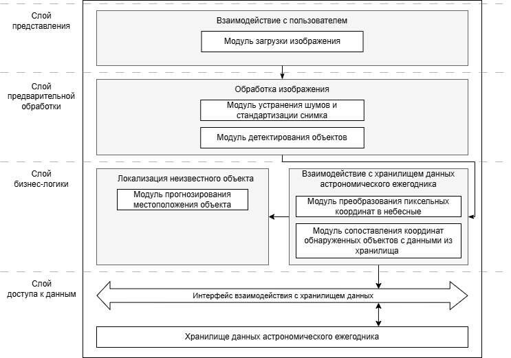

# Проектирование архитектуры метода определения местоположения космического объекта на основе снимка звёздного неба

Ключевые слова: обработка изображений, идентификация космических объектов, астрономические ежегодники, определение местоположения объекта

## Аннотация

Статья посвящена разработке архитектуры метода для автоматизированного определения местоположения космических объектов на изображениях звёздного неба с применением данных астрономических ежегодников. В работе рассмотрена проблема точности астрономических наблюдений за неизвестными объектами в условиях ограниченных данных и ограниченной видимости. Для улучшения точности вычислений предложена интеграция множества астрономических источников и использование современных методов обработки изображений, включая автоматическое определение и идентификацию космических объектов. Приведен анализ существующих технологий и инструментов для решения аналогичных задач. Основной акцент сделан на улучшение точности определения местоположения объектов путем повышения качества обрабатываемых изображений и сопоставления с данными разнообразных астрономических каталогов. Предлагаемая архитектура позволит эффективно решать задачу в условиях неопределенности и низкой видимости, обеспечивая более достоверные результаты астрономических исследований.

## Введение

Определение координат космических объектов становится важной задачей в условиях ограниченных данных и ограниченной видимости[1]. С каждым годом увеличивается количество неизвестных объектов[2], в связи с чем автоматизация нахождения их местоположения становится важной задачей для обеспечения безопасности спутников и космических миссий[3].

Цель данной статьи является разработка архитектуры метода для автоматизированного определения местоположения космического объекта на основе снимка звёздного неба с использованием данных астрономического ежегодника для повышения точности астрономических наблюдений. Объектом исследования являются методы обнаружения космических объектов на основе снимков звёздного неба, предметом - точность методов обнаружения космического объекта на снимках звёздного неба.

В ходе проведения исследования были решены следующие задачи:

1. Обзор существующих методов обнаружения космического объекта по снимкам звёздного неба.
2. Определение критериев для сравнения найденных методов.
3. Сравнение выбранных методов по составленным критериям.
4. Разработка математической модели.

## Обзор предметной области

### Принцип отбора аналогов

В качестве аналогов рассматривались программы, которые определяют космические объекты на снимке, а также их местоположение. Для поиска аналогов использовалась система для поиска научных статей 'Google Scholar', а также сервис 'GitHub' . Поисковые запросы включали следующие ключевые слова: "blind astrometric calibration", "lost in space identification", "detect astronomical images".

#### Astrometry

Данное приложение предназначено для автоматического определения космических объектов на снимках и их местонахождения. В основе работы приложения лежит алгоритм, который использует индексированную базу данных звёздных каталогов и сопоставляет их со звёздами, определенными на снимках, автоматически определяя координаты изображения [4].

#### SExtractor

SExtractor (Source Extractor) - это инструмент, который используется для автоматического извлечения космических объектов со снимков звёздного неба. В данный инструмент встроены алгоритмы для детекции и классификации объектов на основе их светимости и формы. Программа выделяет источники на изображении и предоставляет их параметры [5].

#### Tetra3

Программа для решения задачи определения положения звезд на снимках звёздного неба. Она использует метод, который включает идентификацию характерных звездных образований на изображении с использованием звёздных каталогов, и вычисляет их координаты, такие как прямое восхождение и склонение [6].

#### Openstartracker

Программа с открытым исходынм кодом для отслеживания звезд, предназначенная для использования в космических аппаратах и спутниках. Она использует байесовские алгоритмы для идентификации звезд на изображениях и отслеживания их перемещений. Система сопоставляет звездные изображения с данными из каталогов, что позволяет точно определять ориентацию космического аппарата в пространстве [7].

#### StellarSolver

StellarSolver [8] — инструмент разработанный для определения местоположения объектов на изображениях звездного неба. Данный инструмент сочетает алгоритмы обработки изображений SExtractor, и методы астрометрического решения, реализованные в Astrometry.

### Критерии сравнения аналогов

#### Определяемые объекты

Данный критерий оценивает, какие именно объекты система может обнаружить на снимках звездного неба. Важным аспектом является определение, ограничивается ли система только анализом небесных объектов, информация о которых уже известна, или же она может идентифицировать неизвестные раннее объект.

#### Астрономические ежегодники

Этот критерий описывает какие астрономические ежегодники используются для сопоставления и анализа объектов на снимках звездного неба. Астрономические ежегодники представляют собой источники высокоточных данных о положении небесных объектов, таких как звезды, планеты, спутники, кометы и другие астрономические тела, в заданные моменты времени. Использование различных типов данных и их актуальность в контексте задачи имеют важное значение для точности вычислений, поскольку они позволяют корректно привязать вычисленные координаты к реальному положению объектов на небесной сфере, что в свою очередь способствует повышению точности измерений и улучшению обработки различных типов объектов.

#### Точность определения местоположения

Данный критерий описывает насколько точно происходит определение местоположения объектов на основе снимка звездного неба. Чем выше точность, тем более достоверным считается инструмент для научных и прикладных астрономических исследований. Измеримым показателем для сравнения точности является угловая ошибка — мера, выраженная в угловых единицах, таких как угловые секунды (") или миллисекунды (mas). Угловая ошибка показывает, на сколько отклоняется реальное местоположение объекта от его вычисленного положения.

### Таблица сравнения аналогов

Таблица 1 - Сравнение аналогов по критериям.

| Аналоги         | Определяемые объекты          | Астрономические ежегодники | Точность определения местоположения (Значение угловой ошибки) |
|-----------------|-------------------------------|----------------------------|---------------------------------------------------------------|
| Astrometry      | Известные космические объекты | Звёздный                   | 0.5" - 1"                                                     |
| SExtractor      | Известные космические объекты | -                          | 1" - 2"                                                   |
| Tetra3          | Звёзды                        | Звёздный                   | 0.5" - 2"                                                     |
| Openstartracker | Звёзды                        | Звёздный                   | 0.1"                                                          |
| StellarSolver   | Известные космические объекты | Звёздный                   | 0.1" - 0.3"                                                   |

### Выводы по итогам сравнения

На основе результатов, представленных в таблице 1, можно сделать вывод, что не существует универсального решения, которое позволило бы определить местоположение космического объекта, если о нем нет предварительной информации. Каждое из рассматриваемых решений имеет свои преимущества, однако ни одно из них не объединяет все ключевые критерии:

- Ограничения по определяемым объектам. Все программы, кроме SExtractor, работают с набором данных о звездах или других известных объектах. SExtractor может быть использован для создания астрономических ежегодников, но не предоставляет функционала для обработки объектов.

- Использование астрономических ежегодников. Большинство программ используют звёздные ежегодники, но существует множество других астрономических объектов, таких как планеты, спутники и кометы, которые также могут быть важными для анализа. В SExtractor, в свою очередь, не используются астрономические ежегодники, так как его основная функция заключается в извлечении объектов и их фотометрическом анализе, а не в точном определении их местоположения. SExtractor может служить основой для создания таких ежегодников, что расширяет возможности для его дальнейшего использования.

- Точность определения местоположения. Точность решения задачи каждой программой находится в пределах от 0.1" до 2", то есть значение угловой ошибки не велико. Возможно добиться повышения точности, если учитывать не только звезды, но и другие космические объекты.

## Выбор метода решения

На основе проведенного анализа, разрабатываемое решение должно включать следующие характеристики:

- Идентификация всех объектов на снимке. После предварительного обнаружения объектов необходимо провести их идентификацию, как известных, так и неизвестных объектов.

- Использование множества астрономических ежегодников. Для повышения точности и учета различных типов космических объектов следует использовать широкий набор ежегодников, включая не только звездные, но и содержащие данные о планетах, спутниках, кометах и других объектах.

- Повышение точности определения местоположения. Точность можно повысить путем расширения базы данных и применения различных методов для восстановления изображений, снятых в условиях ограниченной видимости.

## Описание метода решения

Метод определения местонахождения космического объекта можно представить в виде математической модели. Данная модель представляет собой процесс обработки изображений, интеграции данных астрономических ежегодников и анализа координат объектов.

Модель можно описать следующим образом:

$M = (I, A, D, C, L)$, где

- $I$ - изображение, поступающие на обработку программе. С помощью следующей формулы можно конкретизировать, какой набор данных подразумевает под собой изображение:
$I = {<s, p, w, o>}$,где
    - $s$ - множество видимых известных объектов,
    - $w$ - “белые пятна”, например, облака или другие природные явления, которые перекрывают участок неба,
    - $o$ - космический объект, местоположение которого нужно определить.
- $A = {a}$ - это высокоточные каталоги, включающие положения звёзд, планет, спутников и комет. Используются для уточнения положения видимых объектов.
- $D(I)$ - функция выделения объектов на изображении. Она определяет координаты всех элементов , требующих дальнейшего анализа.
- $C : (D, A) → {(x_i​, y_i​)}$ - функция определения местоположения объектов, обнаруженных функцией $D$, с учетом данных, представленных в астрономическом ежегоднике (${a}$).
- $L : {(x_i​,y_i​) ∣ i ∈ D} → (x_o​,y_o​)$ - определение местоположения искомого космического объекта, данные о котором не занесены в астрономический ежегодник.

На основе описанной модели последовательность действий для определения местоположения космического объекта на снимке неизвестного участка неба при неизвестных погодных условий будет следующая:

- Предобработка изображения;
На данном этапе обрабатывается снимок для устранения шумов, улучшения качества и повышения контрастности изображения. Такая обработка позволяет устранить помехи, возникающие из-за погодных условий, например, в виде облаков или атмосферных искажений. Затем происходит выделение ключевых объектов на снимке, таких как звёзды, движущиеся объекты и искомый космический объект для последующей обработки.
- Калибровка координат по изображению;
На основе объектов, выделенных на предыдущем этапе, вычисляются их координаты в пиксельной системе. Затем эти данные преобразуются в небесные координаты, что обеспечивает связь между изображением и данными из астрономического ежегодника.
- Сопоставление полученных координат с данными астрономического ежегодника;
Рассчитанные небесные координаты сопоставляются с базами данных астрономических ежегодников. Этот этап позволяет идентифицировать известные космические объекты и уточнить положение участка неба.
- Прогнозирование местоположения искомого космического объекта.
На основе полученных данных рассчитывается положение искомого объекта относительно дргуих изветсных объектов, видимых на снимке. Координаты звёзд и других небесных тел, определённые на предыдущих этапах, формируют систему ориентира, с помощью которой уточняется позиция искомого объекта.

Данную последовательность действий можно интерпретировать в качестве следующих компонент архитектурны:

- Компонент обработки изображений, который отвечает за устранение шума, стандартизацию снимков (например, преобразование в черно-белый формат, настройка яркости) и детектирование объектов для дальнейшего анализа;
- Компонент взаимодействия с хранилищем данных астрономического ежегодника осуществляет преобразование пиксельных координат в небесные и их дальнейшее сопоставление с данными астрономического ежегодника для идентификации объектов;
- Компонент локализации неизвестного источника на основе координат известных космических объектов прогнозирует местоположение искомого объекта.

На рисунке 1 представлена архитектура решения.

Рис.1 - Архитектура метода определения местоположения космического объекта

## Заключение

В данной статье представлена архитектура метода для автоматизированного определения местоположения космического объекта на основе снимков звёздного неба, с использованием данных астрономического ежегодника.

В процессе отбора и сравнения аналогов были выделены ключевые параметры для их сравнения: точность определения местоположения, поддержка различных типов объектов и использование астрономических ежегодников. Сравнение существующих решений показало, что универсального на данный момент не существует. Выявленные сильные и слабые стороны каждого из методов были учтены при разработке собственного.

Разработанная архитектруа включает в себя последовательность шагов, таких как предобработка изображений, калибровка координат, сопоставление с различными астрономическими данными и прогнозирование местоположения объектов, что позволяет повысить точность и достоверность астрономических наблюдений.

Направление дальнейших исследований будут направлены на реализацию предложенного метода на практике, а также на его дальнейшее совершенствование для повышения точности в условиях ограниченных данных и низкой видимости.

## Список использованных источников

1. Martin, Dennis J., "The Visibility of an Object in a Space Environment", 1962.
2. European Space Agency, “Space Environment Report”, 2021.
3. Хутровский З.Н., Каменский С.Ю., Бойков В.Ф., Смелов В.Л. "Столкновения в космическим пространстве", 1995.
4. Dustin Lang, David W. Hogg, Keir Mierle, Michael Blanton, and Sam Roweis. ASTROMETRY.NET: BLIND ASTROMETRIC CALIBRATION OF ARBITRARY ASTRONOMICAL IMAGES, 2010. 1782-1787.
5. E. Bertin and S. Arnouts. SExtractor: Software for source extraction, 1996. 393-395.
6. Tetra3 - Repository // [URL](https://github.com/esa/tetra3)
7. Openstartracker - Repository // [URL](https://github.com/UBNanosatLab/openstartracker)
8. StellarSolver - Repository // [URL](https://github.com/rlancaste/stellarsolver)