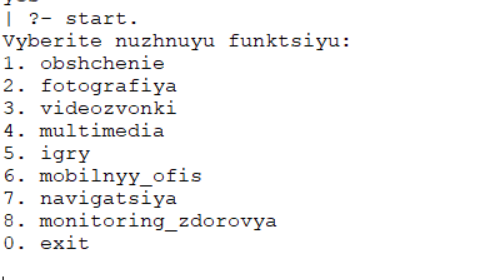
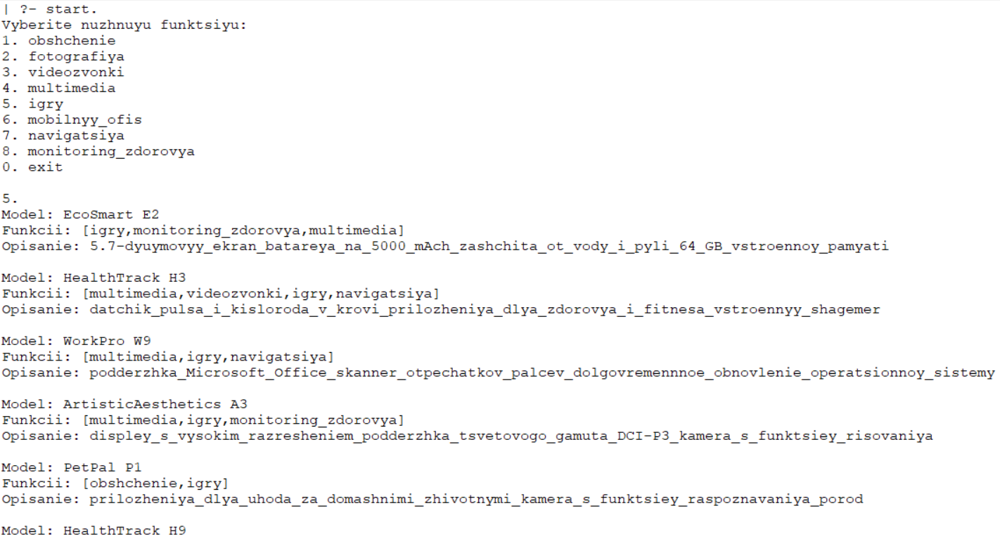
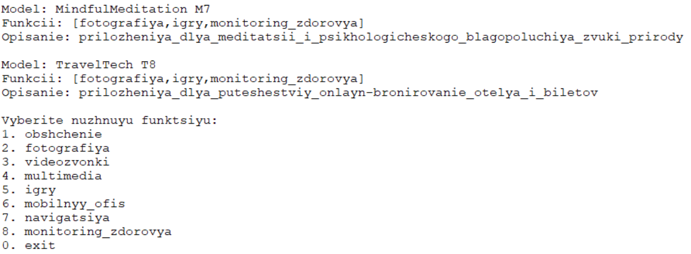
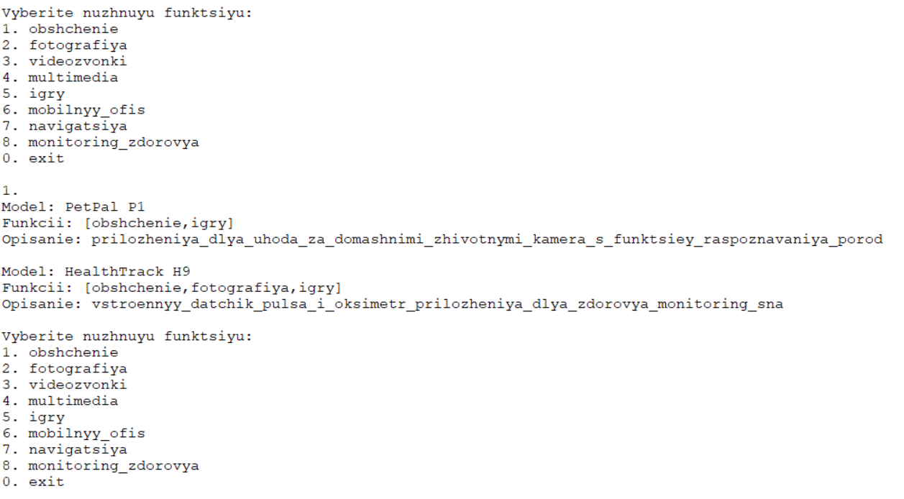

## Описание работы программы

Для разработки консультанта по сотовой связи необходимо сделать базу данных телефонов, в которой будут указаны названия телефонов, их функции и небольшое описание.
Необходимые данные хранятся в файле phones.pl.
Структура фактов хранящихся в phones.pl:

    phone(НазваниеТелефона, СписокФункций, Описание)

пример:

    phone('SportsPro S6', ['obshchenie', 'multimedia', 'navigatsiya'], 'GPS_dlya_otslezhivaniya_trenirovok_vstroennyy_trener').

Опишем загрузку из базы данных:

    % Добавление факта о телефоне из бд.
    addPhoneFact(Stop, Stop):- !.
    addPhoneFact(Index, Stop):-
        read(Fact), % Считываем факт
        Fact \== end_of_file, % если не достигли конца файла продолжаем
        assertz((Fact)), % Добавляем полученный факт
        Tmp is Index + 1, % Увеличиваем счётчик
        addPhoneFact(Tmp, Stop). % Раскручиваем рекурсию

    % Метод для управления счётчиком фактов
    addPhoneFacts:-
        addPhoneFact(0, 22),
        true. % добавлено, чтобы метод не возвращал no 

    load_db:-
        \+dbLoad,!, % если бд не загружена, то загружаем
        see('phones.pl'), % открываем файл
        addPhoneFacts, % Добавляем факты
        seen, % Закрываем файл
        assertz((dbLoad)). % после считывания добавляем факт о загруженной дб

    load_db:- true. % если бд загружена, то возвращаем истину

Для оторажения информации выбора, необходимо добавить факт хрянящий все доступные функции:

    fLst(['obshchenie', 'fotografiya', 'videozvonki', 'multimedia', 'igry', 'mobilnyy_ofis', 'navigatsiya', 'monitoring_zdorovya']).

Таким образом, после выбора пользователем из списка предложенных вариантов, будем отбирать необходимые телефоны с помощью следующего предиката:

    % Функция для фильтрации телефонов по их функциям    
    getFilteredPhones(FuncList, Phones) :-
        true, % checkFunctions может не найти у телефона функцию из списка, возвращаем истину
        % Используем предикт findall из стандартной библиотеки для поиска телефонов с указанными функциями
        findall(Name, (phone(Name, Functions, _), checkFunctions(FuncList, Functions)), Phones).

    % Функция проверка, что в функциях телефона есть необходимые функции  
    checkFunctions([], _).
    checkFunctions([Func|T], Functions) :-
        member(Func, Functions),  % Используем предикат нахождения элемента в списке
        checkFunctions(T, Functions). % продолжаем искать оставшиеся предикаты

Предикат getFilteredPhones/2 возвращает список всех телефонов, в списке функций которых есть выбранные пользователем.

Для отображения выбора пользователя опишем следующие предикаты: 

    % Красиво выводим выбор для пользователя
    printChoiceFunction(_, [ ]):- !.
    printChoiceFunction(N, [H|T]):-
        write(N), write('.'), write(' '), write(H), nl,
        N1 is N + 1,
        printChoiceFunction(N1, T).

    % Оформляев вывод функций
    printChoice:-
        write('Vyberite nuzhnuyu funktsiyu:'), nl,
        fLst(L),
        printChoiceFunction(1, L),
        write('0. exit'), nl, nl. 
        % Оставляем пользователю возможность закончить выбор

Они будут предоставлять пользователю следующий выбор:

Далее необходимо считать выбор пользователя:

    % Считываем выбор пользователя
    makeChoice(Choice):-
        read(Num), Num > 0, !, % Если выбрана функция, то определяем что выбрал пользователь
        Index is Num - 1, fLst(L), getByIndex(L, Index, Choice).
    
    % Функция отрисовки функций и последующий выбор одной из функций
    userChoice(Choice):-
        printChoice,
        makeChoice(Choice),!.

Предикат userChoice/1 объединяет отрисовку выбора и считывание номера, введенного пользователем.

Остаётся только вывести отобранные телефоны:

    % Красивый вывод подходящих телефонов 
    printPhones([ ]):- !.
    printPhones([H | T]):-
        phone(H, Funcs, Descr),
        write('Model: '), write(H), nl,
        write('Funkcii: '), write(Funcs), nl,
        write('Opisanie: '), write(Descr), nl, nl,
        printPhones(T).

Далее собираем воедино все описанные предикаты и создаем удобную точку запуска для пользователя:

    % Функция объеденяющая в себе отрисовку, выбор пользователя и последующую логику программы
    userStart(FuncList):-
        userChoice(CurrentChoice), !,
        getFilteredPhones([CurrentChoice | FuncList], Phones),
        printPhones(Phones),
        userStart([CurrentChoice | FuncList]).

    % Вход в программу
    start:-
        load_db, % загружаем бд перед использованием 
        userStart([]). % запускаем основную логику программы

Далее представлены результаты работы программы:

Запускаем программу, выбираем функцию "Игры". После отображения подходящих телефонов будет предложено отобрать телефоны по ещё одной функции:

Таким образом, после выбора ещё одной функции предложенный список телефонов существенно уменьшается, так как только некоторые телефоны обладают совокупностью указанных функций:

Программа позволяет и дальше отбирать телефоны по нужной функциональности, пока пользователь не закончит выбор вводом нуля.